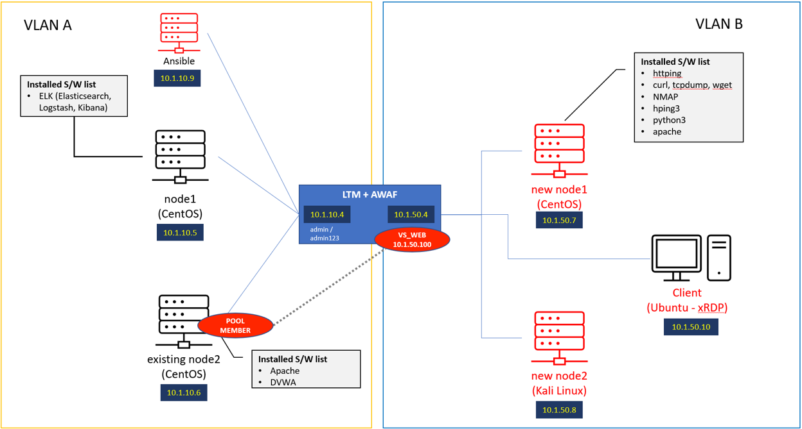

F5 Security Automation with Ansible
===================================

Demonstrating Ansible Security Automation with F5 LTM + WAF
***********************************************************

This Lab will go over the benefits of using F5 Advanced Web Application Firewall (AWAF) by providing scenarios of injection-based attacks and ways to solve by using Ansible Automation and ELK Monitoring.  
The Diagram above shows how the lab is built, as we get deeper into the lab you will learn about the different kinds of injection-based attacks, achieve the attack and then block the attack using BIG-IP AWAF.

.. toctree::
   :maxdepth: 2
   :glob:

   module*/module*